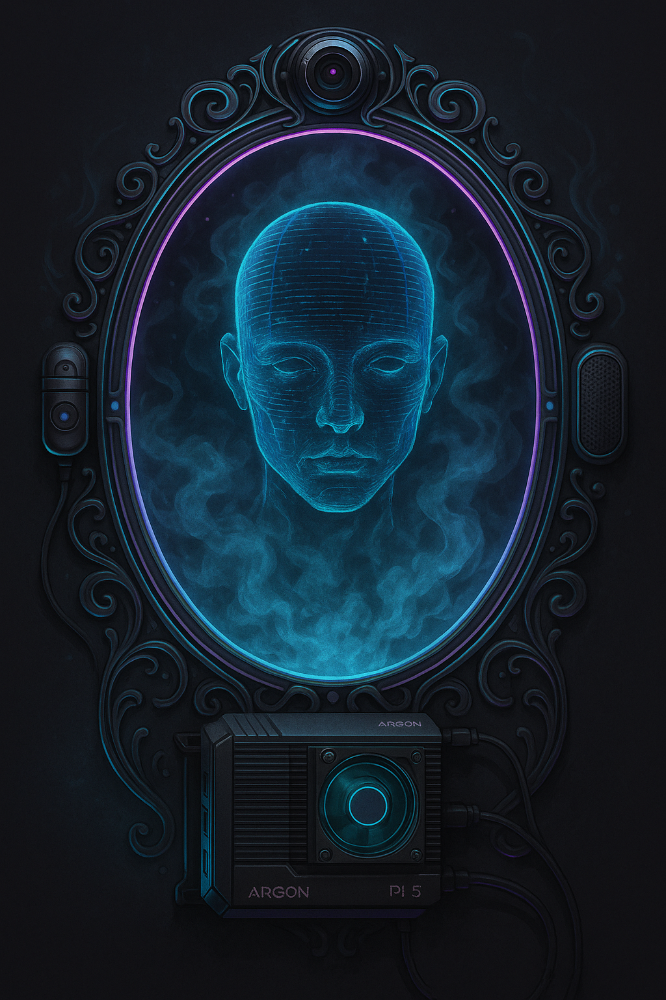

  

# Magic Mirror

This repository documents my personal **MagicMirror²** build — a Raspberry Pi–powered smart mirror with custom modules, hardware tweaks, and a long-term plan for full AI integration. This project is part hardware, part software, and part experimentation in human–computer interaction.

Right now it's a simple smart mirror.  
The end goal is a **holographic-style AI persona** that can see you, talk to you, and respond with awareness and personality.

---

## Features
- Raspberry Pi MagicMirror² installation  
- Custom dark theme and layout  
- Core modules (clock, weather, compliments, system info)  
- Screen + frame mounting setup  
- Early groundwork for sensor integration  

---

## Roadmap — Where This Is Going
This mirror isn’t meant to stay “just a mirror.”  
The long-term vision includes:

### 🧠 **AI Assistant Integration**
- Voice interaction (talk to it naturally)
- Audio output with a unique persona
- Local or cloud LLM inference
- Memory + context awareness
- Tools for live responses (weather, tasks, schedules, system status)

### 👤 **Presence & Identity Recognition**
- Camera-based person detection  
- Face recognition for personalized responses  
- Auto-wake when you walk up  
- “Good morning” style dynamic routines  
- Personal info modules based on who is standing in front of it

### ✨ **Holographic-Style Display**
Creating the illusion of a hologram floating inside the mirror:
- Animated AI avatar / face / geometric visualization  
- Idle animations when no one is in view  
- Voice-synced expressions or waveforms  
- Subtle neon-lit UI that feels alive

### 🔊 **Conversational Behavior**
- Real-time speech-to-text  
- Intelligent back-and-forth dialog  
- Ability to notify, remind, announce  
- Personality-driven responses  
- Optional “assistant mode” vs “quiet mode”

### 🛰️ **Information & Automation**
- Live AI summaries  
- News / events / tasks delivered conversationally  
- Home automation hooks (future)
- Sensor data shaping the UI (temperature, humidity, movement)

### 🛠️ **Hardware Extensions**
- PIR motion sensors  
- Temperature/humidity sensors  
- Camera module  
- Microphone array  
- LED accent lighting  
- Better audio output  

---

## Repository Contents
- `config/` — example MagicMirror config (no private keys) + custom CSS
- `docs/` — build notes, hardware plan, AI integration concepts
- `scripts/` — helper scripts for installing/updating MagicMirror on a Pi
- `media/` — photos and screenshots of the mirror

---

## About This Project
This mirror is an ongoing maker project exploring:
- Raspberry Pi hardware  
- modular JavaScript UI systems  
- sensor integration  
- computer vision  
- real-time AI interaction  
- voice interfaces  
- holographic-style UX  

The goal is eventually to create an **interactive AI presence** living behind the glass — something more than a dashboard, closer to a personal companion that recognizes you, speaks to you, and reacts like a living system.

Work in progress. More updates soon.
